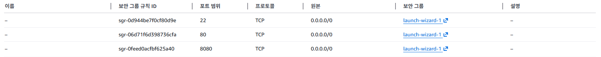

# SPRING PLUS

---

# 필수기능
## Level.1
1. 코드 개선 퀴즈 - @Transactional의 이해
2. 코드 추가 퀴즈 - JWT의 이해
3. 코드 개선 퀴즈 - JPA의 이해
4. 테스트 코드 퀴즈 - 컨트롤러 테스트의 이해
5. 코드 개선 퀴즈 - AOP의 이해

## Level.2
1. JPA Cascade
2. N+1
3. QueryDSL
4. Spring Security

# 도전기능
1. QueryDSL을 사용하여 검색 기능 만들기
2. Transaction 심화
3. AWS 활용
 
---

# AWS
## 공통사항
AWS 서비스의 콘솔에서 내가 만든 서비스들의 설정

## EC2
탄력적 IP설정
[HealthCheck URL](http://15.164.5.61:8080/health/check)